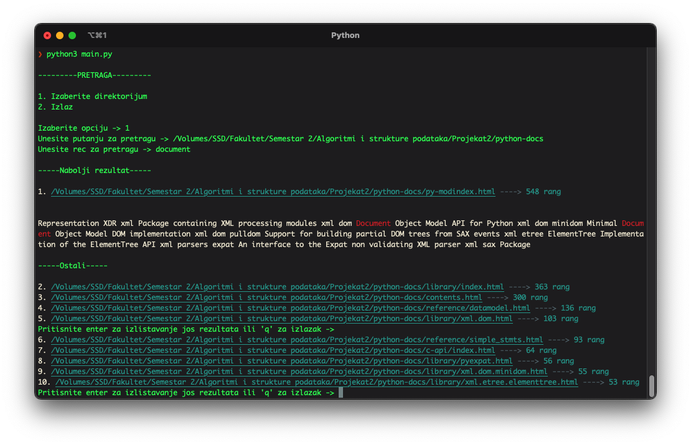
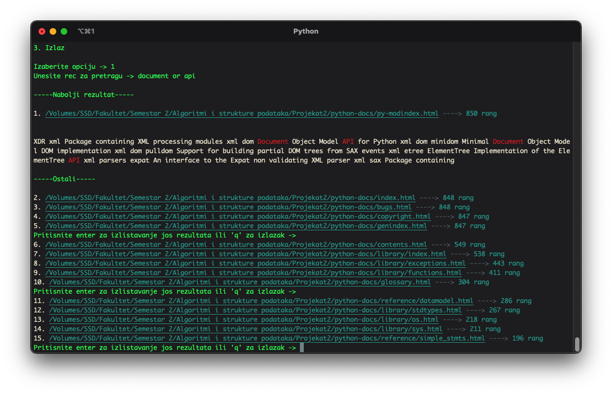

# Description

## Graph (Directed)
Consists of nodes and edges.
In each node, I store the path to the file (HTML page), words on the page, and the structure of a Trie generated from the given words.
Edges serve to connect nodes together (via links).

## Trie
Consists of nodes.
Each node has a character, children, and positions (the position in the list of words where the letter making up this word is located).

Insertion:
For each word, I iterate letter by letter, checking if there is already a node with that letter. If there is, I store the position and proceed; if not, I create a node with that letter, connect it to the node above, and store the position.

Reading:
For each word, I iterate through the letters. If I find that there is no node with the letter in question, the word is not present on the specified page. If I reach the last letter, I check if it exists; if it does, I return the positions of all occurrences of the given word.

## Sorting
Merge sort is used, adapted for a list of lists.

## Search
1. Single Word

For the entered word, I take the number of occurrences of the word in the document, the number of links to the document, as well as the number of occurrences of the word in the document linking to it. I divide the last number by 8.
By summing these three numbers, I get a rank.

2. Words Separated by Space

For each word, I calculate the rank as in 1. and divide by the number of words.
This way, I obtain a rank.

3. NOT Operator

For the first word, I check if it exists in the file; if it doesn't, I skip it. If it does, I check if the other words exist in the file; if they do, I skip, if not, I calculate the rank as in case 1.

4. AND Operator

I check if both words are in the file; if they are, I calculate the rank of both words separately and sum the results, then divide by 2.

5. OR Operator

Same as 2.

## Additional Task (Expression Search)
For each word, return the positions of occurrences.
I recursively check if there is a number in the positions of the first word such that the number + 1 is in the position of occurrence of the second word, and similarly for the other words and positions.
